# Tarea: Procesos - Administrador de tareas

En esta práctica veremos ejercicios sobre los contenidos que hemos visto en teoría.

## Ejercicio 1

Poner en marcha el Bloc de Notas de Windows, el navegador Edge y el Paint.

Lanza el Administrador de Tareas desde el botón de inicio y detén las tres aplicaciones desde el Administrador de Tareas.

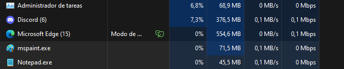

*Terminadas*.

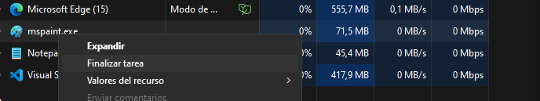
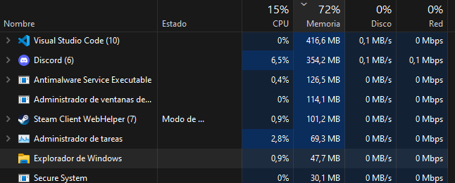

## Ejercicio 2

Utilizando la ventana de Rendimiento del Administrador de Tareas, obtén el tiempo que lleva encendido el Sistema.

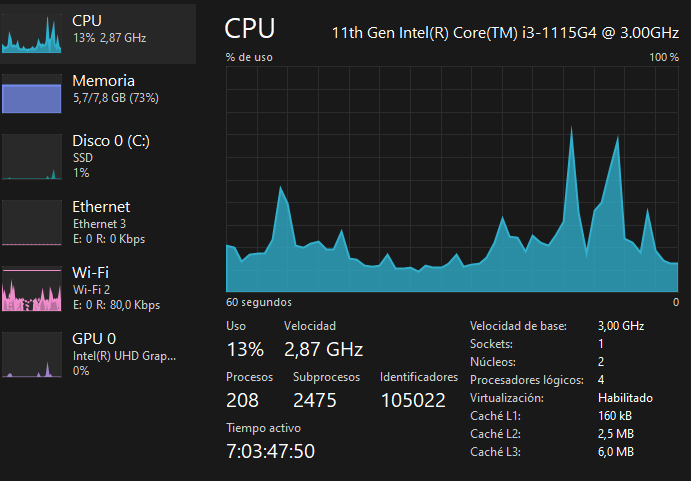

## Ejercicio 3

Elabora una lista con las 3 aplicaciones más utilizadas por el usuario
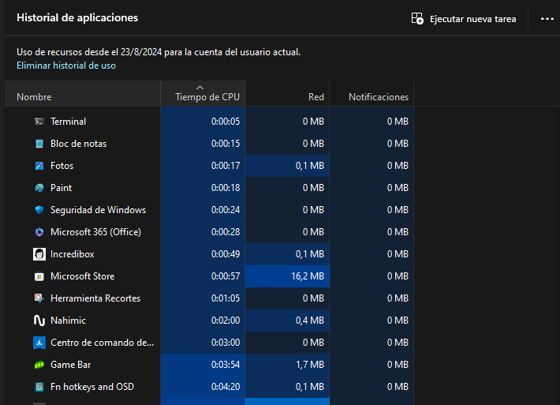
 *adminiso*.

## Ejercicio 4

Necesitamos obtener el nombre y la descripción de una serie de programas que podemos encontrar en el sistema. Mediante la ventana *Detalles*, obtén los siguientes datos (rellena la tabla):

| Aplicación              | Nombre del ejecutable | Descripción |
| ----------------------- | --------------------- | ----------- |
| Bloc de notas           |      Notepad.exe      |    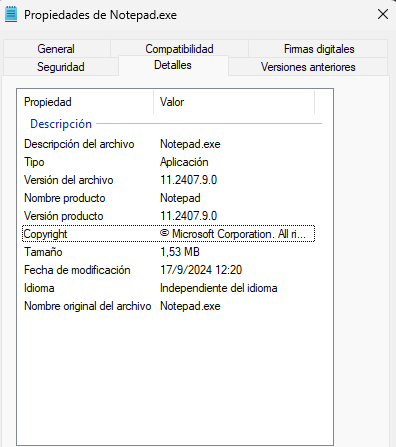 |
| Edge                    |       msedge.exe      |   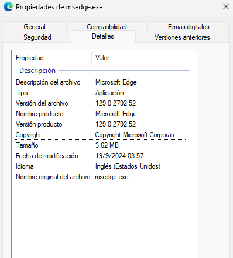  |
| Explorador de ficheros  |       explorer.exe    |   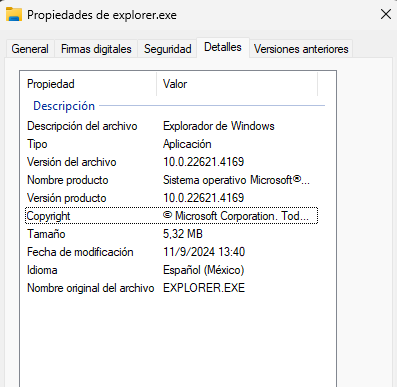  |
| Paint                   |       mspaint.exe     |   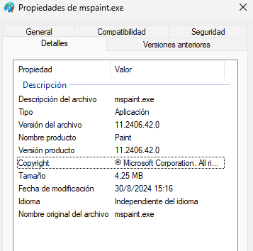  |
| Incredibox              |       incredibox.exe  |   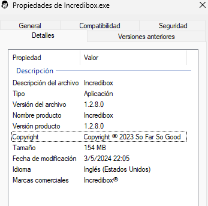  |
| Tienda Microsoft        |     WinStore.App.exe  |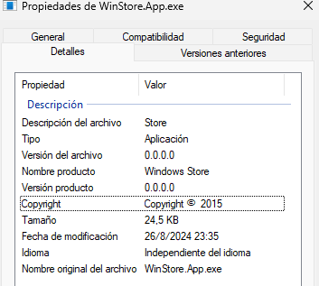|

## Ejercicio 5

Comprueba en tu ordenador de casa cuantas aplicaciones se arrancan en el inicio de la Sesión.
Realiza una captura de pantalla.
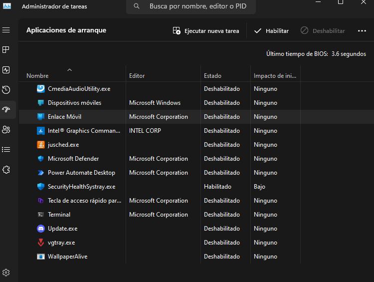

